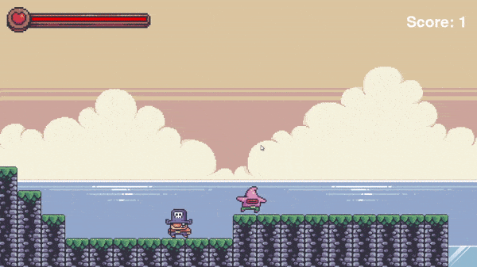
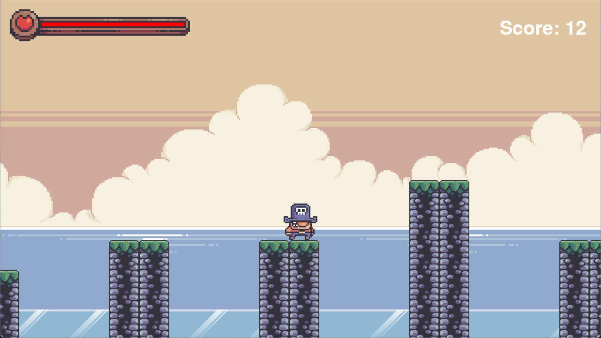
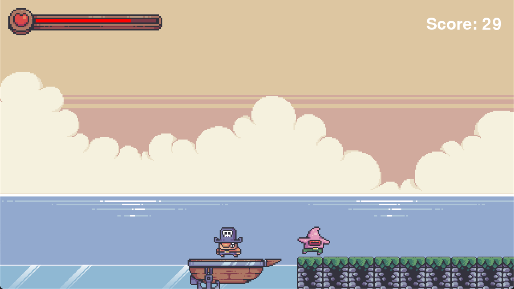
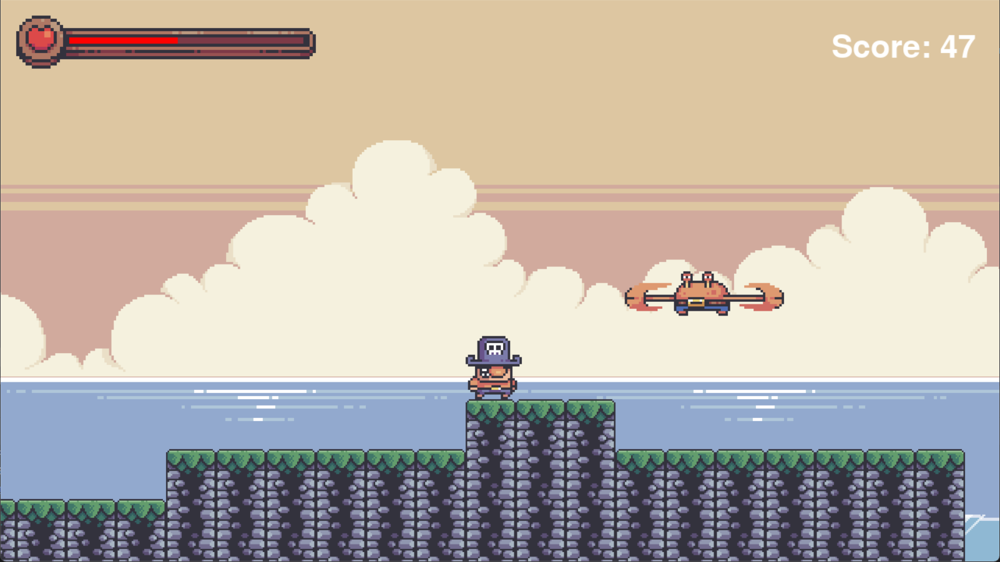
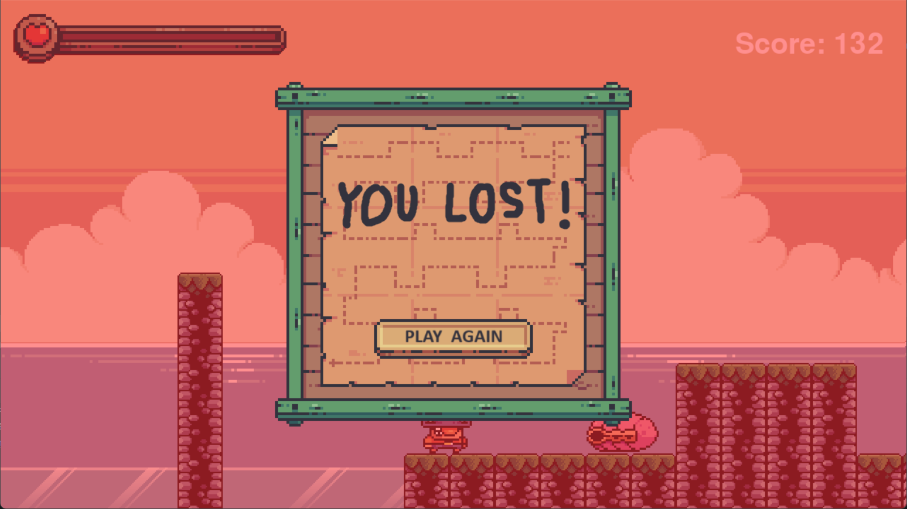

# The Pirate Game

## Overview
The Pirate Game is a simple endless 2D platformer game developed using Python and Pygame. 
The player controls a pirate character navigating through endlessly randomly generated terrain, avoiding obstacles, and opponents.

## Installation
1. Ensure you have Python installed (version 3.6 or higher).
2. Install the required dependencies using pip:
    ```sh
    pip install pygame
    ```

## Running the Game
1. Navigate to the project directory.
2. Run the main game file:
    ```sh
    python src/game.py
    ```

## Controls
- **`←` `→` / `A` `D`**: Move the player left and right.
- **Spacebar**: Jump.
- **Escape**: Quit the game.

## Images







## Acknowledgements
- Pygame library for providing the game development framework.
- Graphic assets https://pixelfrog-assets.itch.io/treasure-hunters
- AI generated music https://sunoai.com
